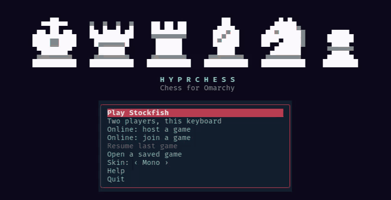
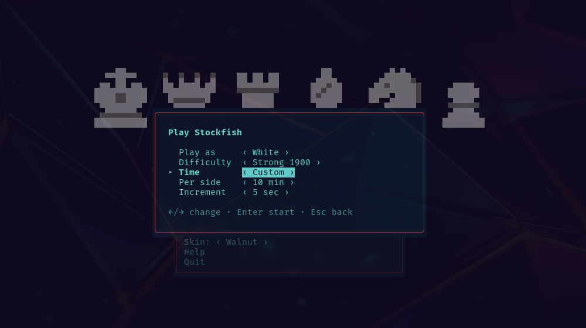
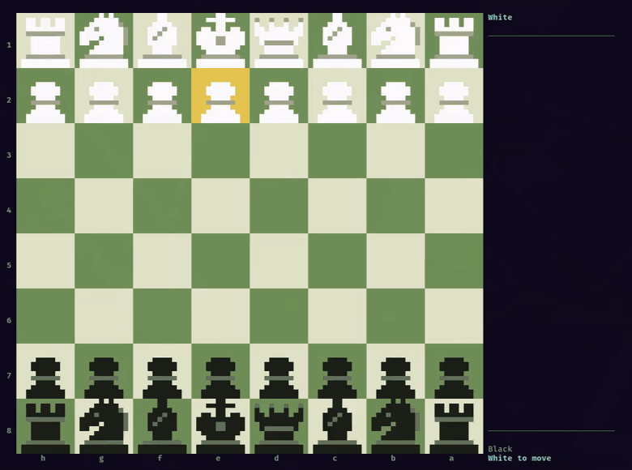
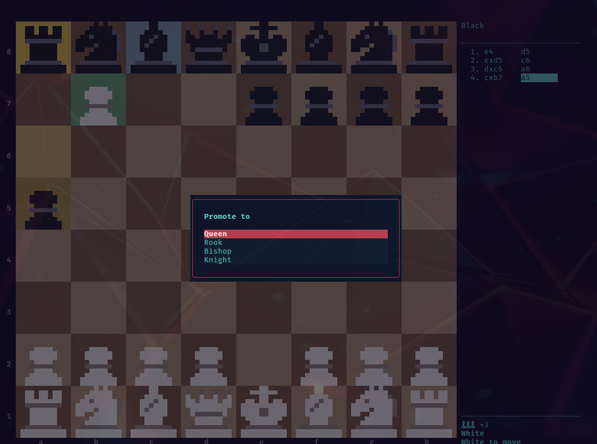
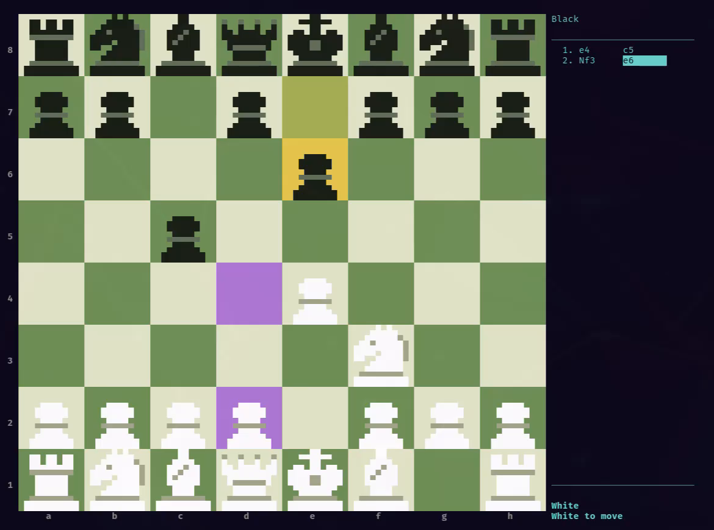
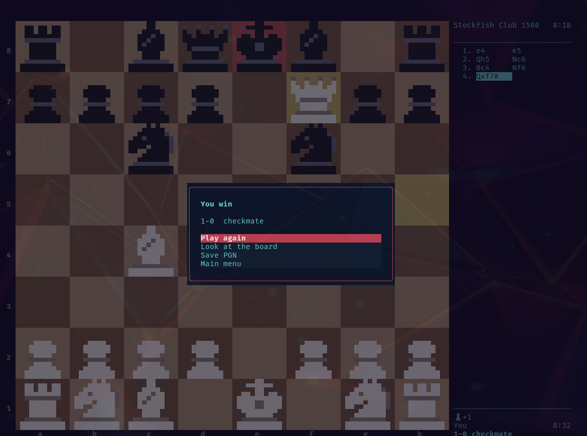
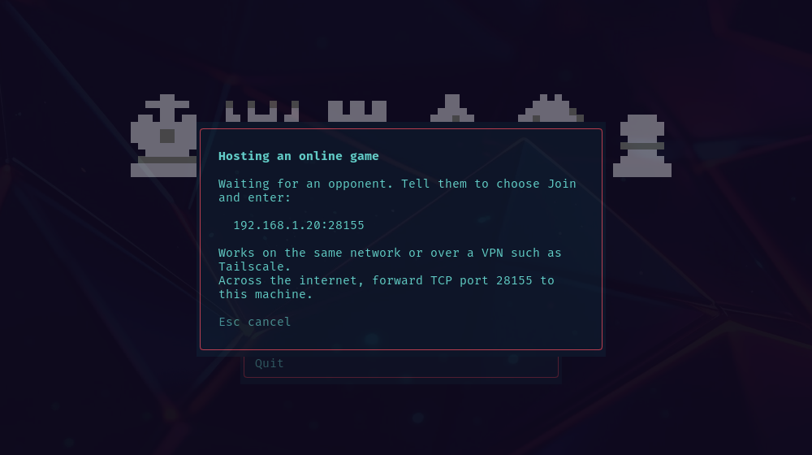
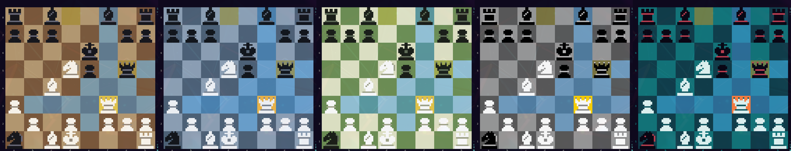
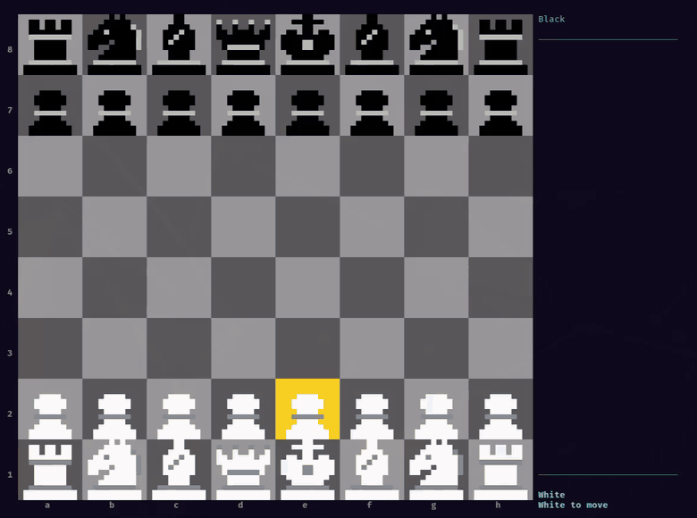
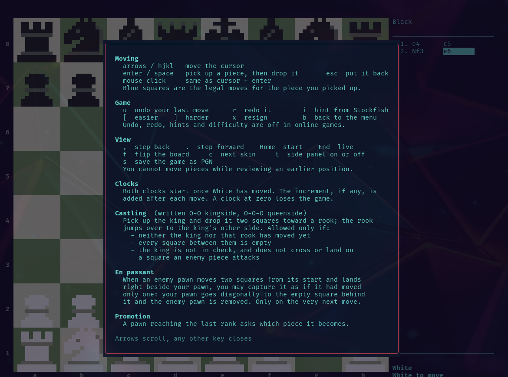

<h1 align="center">hyprchess</h1>

<p align="center">
  <b>Chess in your terminal, on Linux, macOS and Windows.</b><br>
  Play Stockfish or another engine, a friend on the same keyboard, or a friend online, with clocks,<br>
  captured material, full notation and skins you can make yourself.
</p>

<p align="center">
  
</p>

<p align="center">
  <a href="#install">Install</a> ·
  <a href="#game-modes">Game modes</a> ·
  <a href="#the-board">The board</a> ·
  <a href="#the-side-panel">Side panel</a> ·
  <a href="#clocks">Clocks</a> ·
  <a href="#online-play">Online</a> ·
  <a href="#skins">Skins</a> ·
  <a href="#keys">Keys</a>
</p>

<p align="center">
  
</p>

## Install

### Any terminal: Linux, macOS, Windows

hyprchess is a Python package. Pick whichever of these you already have:

```
uvx hyprchess              # run it without installing (uv)
uv tool install hyprchess  # install the hyprchess command (uv)
pipx install hyprchess     # install the hyprchess command (pipx)
pip install hyprchess      # into the current Python environment
```

It needs Python 3.11 or newer and a terminal with 24-bit colour and mouse
support: any current Linux terminal, Terminal.app, iTerm2, Ghostty, kitty,
WezTerm, Alacritty or Windows Terminal. Update with `uv tool upgrade hyprchess`
or `pipx upgrade hyprchess`; remove with `uv tool uninstall hyprchess` or
`pipx uninstall hyprchess`.

To play against the computer you also need a chess engine, see
[Engines](#engines). Everything else works without one.

On Omarchy there are two more ways in, below. Use either or both.

### Bar button (Omarchy plugin)

Adds a chess icon to the Omarchy bar. Clicking it opens the game in a terminal
window, or focuses the game if it is already open.

```
omarchy plugin add https://github.com/namelesstherebel/hyprchess --enable
```

Nothing else is installed: the button runs the game straight from the plugin
folder with `uv`. The first click downloads the two Python dependencies, so it
needs a network connection once; after that it works offline.

To open the game from a keybinding instead of the bar:

```
omarchy-shell io.github.namelesstherebel.hyprchess open
```

Remove it with:

```
omarchy plugin remove io.github.namelesstherebel.hyprchess
```

### App (command and app launcher entry)

```
git clone https://github.com/namelesstherebel/hyprchess && cd hyprchess
./install.sh
```

That installs the `hyprchess` command with `uv tool install` and adds
**hyprchess** to the app launcher (SUPER + SPACE) with its icon. Launching it
again focuses the game that is already running. Run `./install.sh` again after
`git pull` to update. Remove it with:

```
./install.sh --remove
```

### What it needs and what it touches

- **uv** runs the game and fetches its two Python dependencies from PyPI:
  [textual](https://github.com/Textualize/textual) and
  [python-chess](https://github.com/niklasf/python-chess), pinned in `uv.lock`.
  On Omarchy: `mise use -g uv`.
- **A chess engine** is optional and only needed to play against the computer
  or get hints. hyprchess does not install one; see [Engines](#engines).
- **Network**: besides that first dependency download, the game only opens a
  connection when you choose an online game.
- **Files it writes**: `~/.config/hyprchess/` (settings, your skins),
  `~/.local/share/hyprchess/` (saved games), `~/.local/state/hyprchess/` (the
  game to resume) and `~/.cache/hyprchess/` (the plugin's Python environment).
  `install.sh` adds one launcher entry and one icon under `~/.local/share/`.
  Nothing needs root and no existing configuration is changed.

## Engines

hyprchess plays against any [UCI](https://www.chessprogramming.org/UCI) engine
and offers every one it finds under **Opponent** in the setup form.

- **On your PATH.** These are found by name: `stockfish`, `lc0` (Leela Chess
  Zero), `fairy-stockfish`, `komodo`, `berserk`, `ethereal`, `rubichess`,
  `koivisto`, `viridithas` and `stormphrax`.
- **In the engines folder.** Put any engine program in the folder printed by
  `hyprchess --engines-dir` (`~/.config/hyprchess/engines/`) and it shows up
  under its file name. This is the easy route on Windows: download Stockfish
  from [stockfishchess.org/download](https://stockfishchess.org/download/) and
  move the `.exe` there. On Linux and macOS the file must be executable.
- **For one run.** `hyprchess --engine /path/to/engine`.

Getting Stockfish: it is `stockfish` in Homebrew and in most Linux
distributions' package repositories, and a download for every system on
stockfishchess.org.

The six difficulty levels use Stockfish's strength settings. An engine that
lacks a setting ignores it, so with such an engine the Elo-limited levels only
differ in thinking time.

## Game modes

The title screen lists everything you can do. Move with the arrows or `j`/`k`
and press Enter.

| Menu entry | What it does |
| --- | --- |
| **Play the computer** | A game against a chess engine, at the strength and time control you pick. |
| **Two players, this keyboard** | Two people take turns on one machine. Press `f` to flip the board between moves. |
| **Online: host a game** | Wait for a friend to connect to you. |
| **Online: join a game** | Connect to a friend who is hosting. |
| **Resume last game** | Carry on the unfinished game against the engine or a local opponent. |
| **Open a saved game** | Replay a game you saved, move by move. |
| **Skin** | Left and right change the look of the board and pieces. |

### Setting up a game

<p align="center">
  
</p>

Up and down pick a row, left and right change it, Enter starts. Your choices are
remembered for next time.

- **Play as**: White, Black or Random.
- **Opponent**: which engine to play, when more than one is installed.
- **Difficulty**: six levels.

  | Level | How it plays |
  | --- | --- |
  | Beginner | Looks one move ahead at the lowest skill setting. Makes mistakes often. |
  | Casual | Looks three moves ahead at low skill. |
  | Club 1500 | Limited to about 1500 Elo. |
  | Strong 1900 | Limited to about 1900 Elo. |
  | Expert 2300 | Limited to about 2300 Elo. |
  | Maximum | Full strength, 1.5 seconds per move. |

  `[` and `]` change the level during a game.
- **Time**: see [Clocks](#clocks).

## The board

<p align="center">
  
</p>

- **It fits your window.** The board redraws at the largest of five sizes that
  fits, every time the terminal is resized. The three larger sizes use
  hand-drawn pixel pieces; small windows fall back to chess glyphs. When the
  window is too narrow for a side panel, the panel moves under the board.
- **Keyboard or mouse, mixed freely.** Move the cursor with the arrows or
  `hjkl` and press Enter to pick up a piece and again to drop it. `Esc` puts
  the piece back.
- **The mouse is built for fast games.** Click a piece and click its square, or
  press on the piece, drag and let go. Either way the move is played the moment
  the button goes down or comes up on the target, with no wait for a full
  click. Clicking the held piece again, or the right button, puts it back.
- **Legal moves are shown.** Picking up a piece tints every square it can go
  to, including castling and en passant squares. Illegal moves are simply not
  offered.
- **Highlights.** The last move, the cursor, the selected piece and a king in
  check each have their own colour.
- **Promotion.** A pawn reaching the last rank asks what it should become.

<p align="center">
  
  
</p>

- **Hints.** `i` asks the engine for the best move and tints its two squares
  (right, above). Hints are off in online games.
- **Undo and redo.** `u` takes back your last move (and the engine's reply);
  `r` puts it back. Playing a new move clears the redo history.
- **Flip.** `f` turns the board around.

## The side panel

The panel beside the board shows, from top to bottom:

- **Each player's name and clock.** The side to move is in bold and its clock
  is highlighted; under ten seconds it turns red and shows tenths.
- **Captured material.** The pieces each side has taken, strongest first, and
  how many points the leader is ahead (`+3`). Pawn 1, knight and bishop 3,
  rook 5, queen 9.
- **Notation.** Every move in standard algebraic notation, with the current
  move highlighted. Long games scroll to keep it in view.
- **Status.** Whose move it is, check, "Stockfish thinking…", or the result.

Press `t` to hide the panel; the board grows into the space and a one-line
status stays underneath.

### Looking back through a game

`,` and `.` step backward and forward through the moves, and `Home` and `End`
jump to the start and back to the live position. The board shows the earlier
position and the notation highlights where you are. You cannot move pieces
while looking at an earlier position.

### When the game ends

<p align="center">
  
</p>

Checkmate, stalemate, draws by repetition, the fifty-move rule or insufficient
material, resignation (`x`) and running out of time all end the game with a
dialog: play again, look at the final board, save it, or go back to the menu.

### Saving and resuming

- `s` saves the game as a PGN file in `~/.local/share/hyprchess/`, with the
  players, date, time control and result. Any chess program can open it.
- **Open a saved game** on the title screen replays one of those files.
- Games against Stockfish and two-player games are saved after every move.
  Quit with `q` or go back with `b` whenever you like, then choose **Resume
  last game**. Clocks are restored too.

## Clocks

| Preset | Each side gets | Added per move |
| --- | --- | --- |
| Bullet 1+0 | 1 minute | nothing |
| Blitz 3+2 | 3 minutes | 2 seconds |
| Blitz 5+0 | 5 minutes | nothing |
| Rapid 10+0 | 10 minutes | nothing |
| Rapid 15+10 | 15 minutes | 10 seconds |
| Classical 30+20 | 30 minutes | 20 seconds |
| No clock | unlimited | |
| Custom | 1 to 90 minutes | 0 to 30 seconds |

Both clocks start once White has made the first move. The increment is added
when you finish a move. A clock that reaches zero loses the game. Against
Stockfish, the engine never thinks for more than a sliver of its remaining time.

## Online play

<p align="center">
  
</p>

1. One player chooses **Online: host a game**, picks a side and a time control,
   and gets an address such as `192.168.1.20:28155`.
2. The other chooses **Online: join a game** and types that address.
3. The joiner gets the host's settings and the opposite colour, and the game
   starts.

Good to know:

- It is a **direct connection** between the two machines. It works on the same
  network, or over a VPN such as Tailscale. Across the open internet the host
  must forward TCP port 28155.
- There is **no account, server or matchmaking**, and the connection is **not
  encrypted**.
- Every move received is checked against the rules. A peer that sends an
  illegal move is disconnected instead of obeyed.
- Each side's clock is the authority for its own time, so lag never flags you
  on the other player's screen.
- Undo, redo, hints and difficulty are off. `x` resigns; leaving with `b`
  asks first, then resigns.

## Skins

<p align="center">
  
</p>
<p align="center"><i>Walnut · Slate · Forest · Mono · Omarchy</i></p>

Press `c` during a game, or use left and right on the **Skin** row of the title
screen. Your choice is remembered.

<p align="center">
  
</p>

- **Omarchy** is generated from your current Omarchy theme, and the menus and
  dialogs follow that theme as well.
- **Letters** swaps the chess glyphs for `K Q R B N P` on the two smallest
  board sizes, for fonts without chess symbols.

### Make your own

Drop a `.toml` file into `~/.config/hyprchess/skins/` (run
`hyprchess --skins-dir` to print the folder) and restart. It appears in the skin
list. A file that can't be read is skipped with a message saying why.

Only the colours are required:

```toml
name = "Ocean"

[board]
light = "#9cc4d9"
dark = "#3d6f8a"

[white]
body = "#ffffff"     # main colour of the white pieces
detail = "#8fa3ad"   # bands, eyes and other accents

[black]
body = "#101820"
detail = "#5f7f91"
```

Optional extras:

```toml
[board]
# highlights; each defaults to a tint of your square colours
cursor = "#e8c84a"
selected = "#6fa86f"
check = "#c0504d"
hint = "#b07ad9"
label = "#8a8a8a"
last_light = "#cdc26a"
last_dark = "#a39a3d"
target_light = "#86aebf"
target_dark = "#557f96"

[glyphs]            # characters used on the two smallest board sizes
king = "K"
queen = "Q"
rook = "R"
bishop = "B"
knight = "N"
pawn = "P"

[sprites]           # your own pixel pieces for the 8, 10 or 12 pixel boards
8 = """
...XX...
..XXXX..
(8 rows per piece, six pieces: king, queen, rook, bishop, knight, pawn)
"""
```

In a sprite, `X` is the body colour, `o` the detail colour and `.` is empty.
Each sheet is six square blocks stacked top to bottom;
[`hyprchess/sprites.py`](hyprchess/sprites.py) has the built-in ones to copy
from. Sizes you leave out keep the built-in art. A skin whose `name` matches a
built-in one replaces it.

## Keys

| Key | Action |
| --- | --- |
| arrows / `hjkl` | move the cursor |
| left click, or drag | pick up a piece, then drop it |
| right click | put the piece back |
| `enter` / `space` | pick up a piece, then drop it |
| `esc` | put the piece back |
| `u` / `r` | undo / redo |
| `,` / `.` / `Home` / `End` | step through earlier positions |
| `i` | hint from the engine |
| `[` / `]` | easier / harder |
| `f` | flip the board |
| `c` | next skin |
| `t` | show or hide the side panel |
| `s` | save the game as PGN |
| `x` | resign |
| `b` | back to the menu (the game is kept for Resume) |
| `?` | help |
| `q` | quit |

<p align="center">
  
</p>

`?` opens this reference in the game, including how castling and en passant
work.

## Configuration

Settings are remembered between runs in `~/.config/hyprchess/config.json`: the
skin, your last setup choices and the last address you joined. You can also set
`"engine": "/path/to/engine"` there to add a UCI engine. On Windows `~` is your
user folder, `C:\Users\you`. Command-line
options:

```
hyprchess --engine /path/to/engine   # play against another UCI engine
hyprchess --skin Slate               # start with a skin
hyprchess --skins-dir                # print the folder custom skins go in
hyprchess --engines-dir              # print the folder engines can be dropped in
```

## Development

```
uv run hyprchess
uv run pytest
```

The tests drive the real app through its keyboard, including an online game
between two instances and, when Stockfish is installed, a game against it.

## License

GPL-3.0-or-later. hyprchess uses [python-chess](https://github.com/niklasf/python-chess)
(GPL-3.0) for the rules and talks to Stockfish as a separate program.

Inspired by [chess-tui](https://github.com/thomas-mauran/chess-tui).
