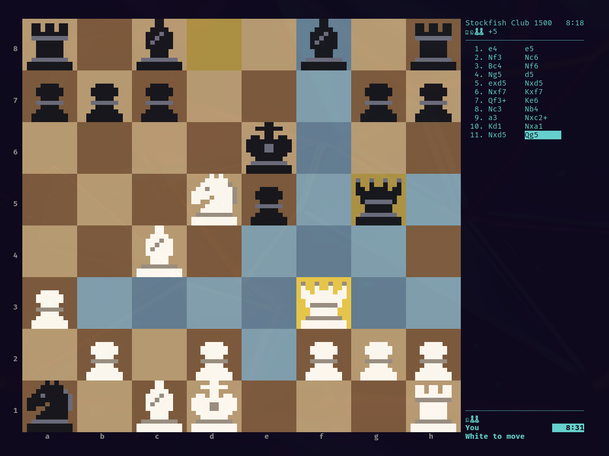

# hyprchess

Terminal chess for Omarchy. Play Stockfish, a friend on the same keyboard, or a
friend online, with clocks, captured material, full notation and custom skins.
The board resizes with the window and uses hand-drawn pixel pieces when there is
room.



## Install

hyprchess has two parts. Use either or both.

### Bar button (Omarchy plugin)

Adds a chess icon to the Omarchy bar. Clicking it opens the game in a terminal
window, or focuses the game if it is already open.

```
omarchy plugin add https://github.com/namelesstherebel/hyprchess --enable
```

Nothing else is installed: the button runs the game straight from the plugin
folder with `uv`. The first click downloads the two Python dependencies, so it
needs a network connection once; after that it works offline.

To open the game from a keybinding instead of the bar:

```
omarchy-shell io.github.namelesstherebel.hyprchess open
```

Remove it with:

```
omarchy plugin remove io.github.namelesstherebel.hyprchess
```

### App (command and app launcher entry)

```
git clone https://github.com/namelesstherebel/hyprchess && cd hyprchess
./install.sh
```

That installs the `hyprchess` command with `uv tool install` and adds
**hyprchess** to the app launcher (SUPER + SPACE) with its icon. Launching it
again focuses the game that is already running. Run `./install.sh` again after
`git pull` to update. Remove it with:

```
./install.sh --remove
```

### What it needs and what it touches

- **uv** runs the game and fetches its two Python dependencies from PyPI:
  [textual](https://github.com/Textualize/textual) and
  [python-chess](https://github.com/niklasf/python-chess), pinned in `uv.lock`.
  On Omarchy: `mise use -g uv`.
- **Stockfish** is optional and only needed to play against the computer or get
  hints. hyprchess does not install it; it uses `stockfish` from your PATH, or
  the engine you pass with `--engine /path/to/engine`.
- **Network**: besides that first dependency download, the game only opens a
  connection when you choose an online game (see below).
- **Files it writes**: `~/.config/hyprchess/` (settings, your skins),
  `~/.local/share/hyprchess/` (saved games), `~/.local/state/hyprchess/` (the
  game to resume) and `~/.cache/hyprchess/` (the plugin's Python environment).
  `install.sh` adds one launcher entry and one icon under `~/.local/share/`.
  Nothing needs root and no existing configuration is changed.

## Playing

| Key | Action |
| --- | --- |
| arrows / `hjkl`, mouse | move the cursor |
| `enter` / `space` | pick up a piece, then drop it |
| `esc` | put the piece back |
| `u` / `r` | undo / redo |
| `,` / `.` / `Home` / `End` | step through earlier positions |
| `i` | hint from Stockfish |
| `[` / `]` | easier / harder |
| `f` | flip the board |
| `c` | next skin |
| `t` | show or hide the side panel |
| `s` | save the game as PGN |
| `x` | resign |
| `b` | back to the menu (the game is kept for Resume) |
| `?` | help, including castling and en passant |

Games against Stockfish and two-player games are saved after every move; choose
**Resume last game** on the title screen. Saved PGNs go to
`~/.local/share/hyprchess/` and can be replayed with **Open a saved game**.

## Online play

One player chooses **Online: host a game**, picks a side and a time control, and
gets an address such as `192.168.1.20:28155`. The other chooses **Online: join a
game** and types it in.

This is a direct connection between the two machines: it works on the same
network or over a VPN such as Tailscale. Across the open internet the host must
forward TCP port 28155. The connection is not encrypted and there is no account
or matchmaking server.

## Custom skins

Drop a `.toml` file into `~/.config/hyprchess/skins/` (run `hyprchess --skins-dir`
to print the folder) and restart. It appears in the skin list on the title
screen and under `c` in a game. A file that can't be read is skipped with a
message saying why.

Only the colours are required:

```toml
name = "Ocean"

[board]
light = "#9cc4d9"
dark = "#3d6f8a"

[white]
body = "#ffffff"     # main colour of the white pieces
detail = "#8fa3ad"   # bands, eyes and other accents

[black]
body = "#101820"
detail = "#5f7f91"
```

Optional extras:

```toml
[board]
# highlights; each defaults to a tint of your square colours
cursor = "#e8c84a"
selected = "#6fa86f"
check = "#c0504d"
hint = "#b07ad9"
label = "#8a8a8a"
last_light = "#cdc26a"
last_dark = "#a39a3d"
target_light = "#86aebf"
target_dark = "#557f96"

[glyphs]            # characters used on the two smallest board sizes
king = "K"
queen = "Q"
rook = "R"
bishop = "B"
knight = "N"
pawn = "P"

[sprites]           # your own pixel pieces for the 8, 10 or 12 pixel boards
8 = """
...XX...
..XXXX..
(8 rows per piece, six pieces: king, queen, rook, bishop, knight, pawn)
"""
```

In a sprite, `X` is the body colour, `o` the detail colour and `.` is empty.
Each sheet is six square blocks stacked top to bottom; `hyprchess/sprites.py`
has the built-in ones to copy from. Sizes you leave out keep the built-in art.

A skin whose `name` matches a built-in one replaces it. The **Omarchy** skin is
generated from your current Omarchy theme.

## Configuration

Settings are remembered between runs in `~/.config/hyprchess/config.json`: the
skin, your last setup choices and the last address you joined. You can also set
`"engine": "/path/to/engine"` there to use a different UCI engine. Command-line
options:

```
hyprchess --engine /path/to/engine   # play against another UCI engine
hyprchess --skin Slate               # start with a skin
hyprchess --skins-dir                # print the folder custom skins go in
```

## Development

```
uv run hyprchess
uv run pytest
```

## License

GPL-3.0-or-later. hyprchess uses [python-chess](https://github.com/niklasf/python-chess)
(GPL-3.0) for the rules and talks to Stockfish as a separate program.
